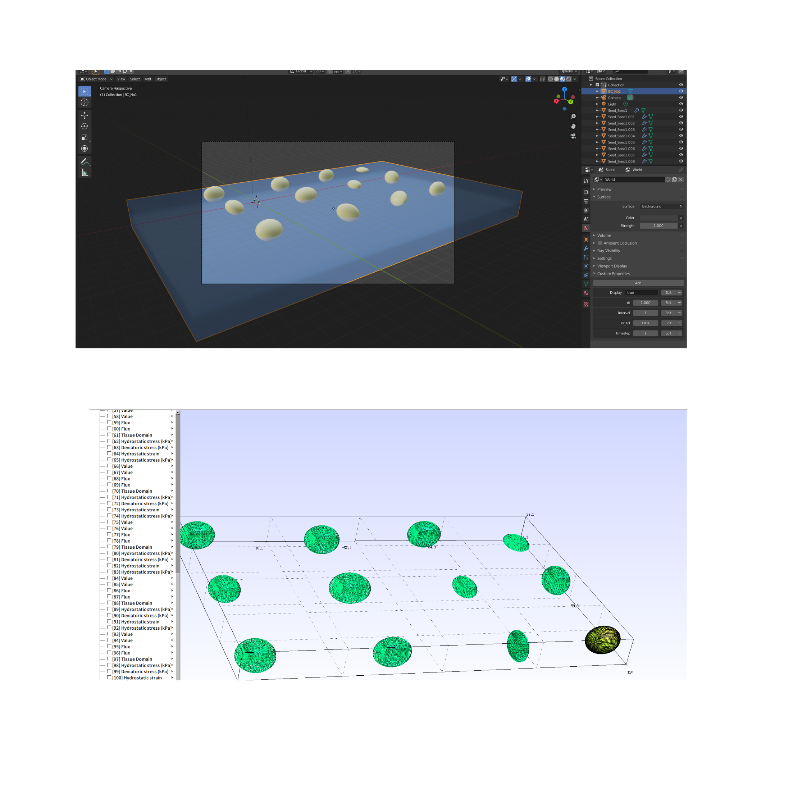
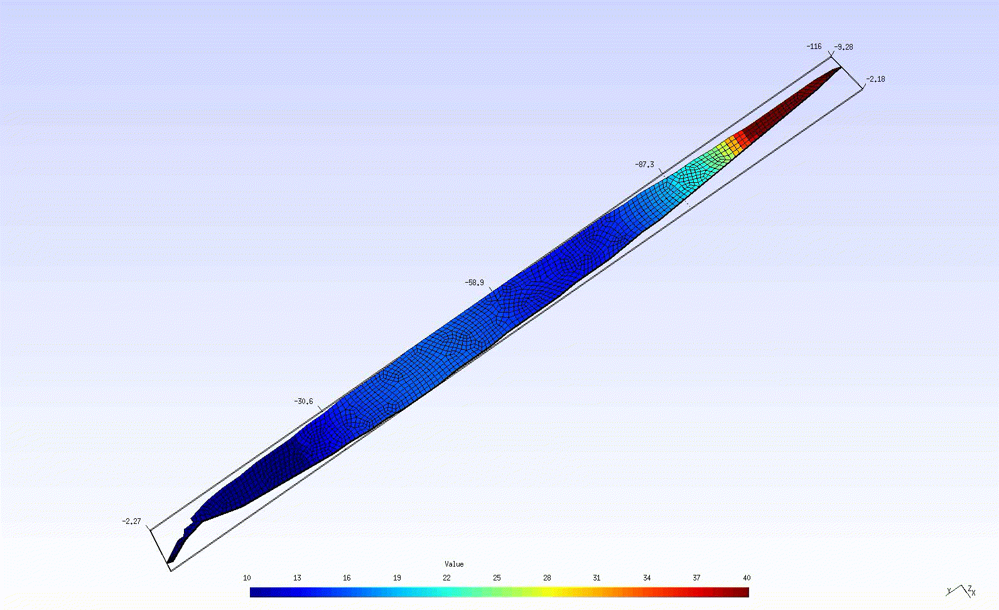

# [Click here!! >> Home page](https://plantfem.org)

# For Windows users:

### How to install 

1. Activate your WSL2 (Windows 10)


2. Install "Ubuntu 20.04" from Microsoft Store


3. Run command

```
apt update && apt upgrade -y
git clone https://github.com/kazulagi/plantfem
cd plantfem
python3 install.py
```

4. You can open files by this command

```
explorer.exe .
```

5. Enjoy!

# Sample codes

You can search sample codes by

```
plantfem search
```

and type your keywords.

# Use plantfem by pip (Under develpment)

```shellscript
mkdir your_project
cd your_project
git clone https://github.com/kazulagi/plantfem
cd plantfem
python3 install.py
```
Then, run your script

```python

import plantfem as pf

soy = pf.soybean(name="hello_soy")
soy.create(config="./plantfem/Tutorial/playon_obj/realSoybeanConfig.json")
soy.msh(name="hello_soy")
soy.json(name="hello_soy")

#soy.stl(name="hello_soy")

# path to plantfem
soy.run(path="./plantfem")

```

#
#
#


# plantFEM
[](https://colab.research.google.com/drive/1H5cmdKa9MJUC-22dHnvIgo8k6sdQ6NnF?usp=sharing)


Plant simulator based on Finite Element Method (FEM).
(Renamed from its old name "SiCroF")

- Tutorial:
[Click here!](https://kazulagi.github.io/pf/)

- Documentation:
[Click here!](https://kazulagi.github.io/plantfem.github.io/)


## Installation

On Ubuntu 18.04 or later,

```
git clone https://github.com/kazulagi/plantFEM.git && cd plantFEM && ./plantfem setup
```

If you want to build and run as a docker container,

- (1) Activate "Docker for Windows" (https://docs.docker.com/docker-for-windows/)


- (2) Open command-prompt and run

```{.copy}
git clone https://github.com/kazulagi/plantFEM.git && cd plantFEM/docker
```

- (3) Build docker-image

```
docker build github.com/kazulagi/plantfem
```

- (4) Login into docker-container

```
docker run --rm -it kazulagi/plantfem /bin/bash
```

## Documentation of plantFEM


[使い方：日本語版 >> ](https://qiita.com/soybean) https://qiita.com/soybean


[ New!  simplified class-structure >> ](doc/README/class.pdf)

## New! sample codes and tutorials of module "std" 


[ <std #1> Standard math library for plantFEM             >> ](Tutorial/playon_std/ex0001_math.f90)


[ <std #2> Kernel for file-IO                             >> ](Tutorial/playon_std/ex0002_fileIO.f90)


[ <std #3> Standard array-operation library for plantFEM  >> ](Tutorial/playon_std/ex0003_array.f90)


[ <std #4> Linear solvers for plantFEM                    >> ](Tutorial/playon_std/ex0004_linearsolvers.f90)


[ <std #5> Kernel for parallel computing using MPI        >> ](Tutorial/playon_std/ex0005_mpi.f90)


[ <std #6> Kernel for RSA-encryption (just for fun)       >> ](Tutorial/playon_std/ex0006_RSAencryption.f90)

## New! sample codes and tutorials of module "fem" 

[ <fem #1> domain-creation library for plantFEM           >> ](Tutorial/playon_fem/ex0001_mesh.f90)


## How to use plantFEM as a blender-addon.

[How to use plantFEM as a blender-addon. >>](doc/BlenderAddon.md)


## How to run your *.f90 script with plantFEM.
### Command-line mode:


```
plantfem your_script.f90
```

### Interactive mode

 ```
 python3 plantfem.py
 >>> your_script.f90
 ```


## Environment

### Google Colab !new!

This can run in Google-Colab.

Installation:
```
!git clone https://github.com/kazulagi/plantfem.git
%cd plantfem
%ls
!python3 install.py
!plantfem install
```
Execution:

```
!./plantfem your_script.f90
```


### Linux 

#### Ubuntu 18.04

```
sudo apt update
sudo apt upgrade -y
sudo apt install git
git clone https://gitlab.com/kazulagi/plantfem.git
cd plantfem
sudo apt install python3
python3 setup.py
jupyter-notebook
```

- Execute Gmsh and go to Tools>Mesh>General and check "Recombine all triangular meshes", then, click File>Save Option As Default  and close window.

### macOS (Mojave)


Install homebrew (https://brew.sh/index)

```
/usr/bin/ruby -e "$(curl -fsSL https://raw.githubusercontent.com/Homebrew/install/master/install)"

```

And, install other applications.


```
brew install git
git clone https://gitlab.com/kazulagi/plantfem.git
cd plantfem
brew install python3
python3 setup.py
jupyter-notebook
```

### Windows (10.0)

Please activate Windows Subsystem for Linux (WSL) and install Ubuntu 18.04 according to the article.
(Windows Windows Subsystem for Linux (WSL) を有効にしてください。 )
https://qiita.com/Aruneko/items/c79810b0b015bebf30bb

Install following applications 
（その後、以下のアプリケーションをインストールします。）
- VScode(https://code.visualstudio.com)

and, 

(1) Enable WSL.
(2) Install Ubuntu 20.04 from Windows store.
(2) Open VScode
(3) Open terminal and type

```
wsl
cd ~/
sudo apt update
sudo apt upgrade -y
sudo apt install git
git clone https://gitlab.com/kazulagi/plantfem.git
cd plantfem
sudo apt install python3
python3 setup.py
```

(4) Open CLI mode of plantFEM
```
python3 SiCorF.py
```
(5) Install
```
install
```

(6) Set path to Home and Desktop directories.
```
>>>[Enter]
Hello.f90[Enter]
type your username[Enter]
```
(7) Open Hello.f90 on your Desktop of Windows by VScode and edit it!

(8) To run your program (e.g. Hello.f90), type
```
Desktop/Hello.f90
```

## Use plantfem as a webserver

Run

```
python3 server.py
```
Client API/Example:

```


curl-XPOST -d @send.json -H "Content-Type: application/json" https://asia-northeast2-plantfem-api.cloudfunctions.net/plantfem > soy_get3.json
```


## How to make and use your original add-on.

(1) Create your add-on in plantfem/addon or other places. An example is shown in addon/addon_example.f90

```Fortran
module addon_example
    use SiCroF
    type::addon_example_
        ! Member variables
        real(real64),private :: realVal
        real(int32 ),private :: intVal
    contains
        ! methods (public_name => private_name)
        procedure :: set => setaddon_sample
        procedure :: show => showaddon_sample
    end type
contains

! Definitions of methods

! ################################################
subroutine setaddon_sample(obj,realVal, intVal)
    class(addon_example_),intent(inout) :: obj
    real(real64),optional,intent(in) :: realVal
    integer(int32),optional,intent(in) :: intVal

    obj%realVal = input(default=0.0d0, option=realVal)
    obj%intVal  = input(default=0, option=intVal)

end subroutine
! ################################################


! ################################################
subroutine showaddon_sample(obj)
    class(addon_example_),intent(in) :: obj
    print *, "Real-64bit value is :: ", obj%realVal
    print *, "int-32bit value is  :: ", obj%intVal
end subroutine
! ################################################

end module addon_example
```

(2) Compile your addon by typing "addon" after


```
python3 plantfem.py

>>> addon
installing add-on
Directory path of your awesome addon is : (default path = addon)
> addon
installing from addon
addon_example
Compiling ./addon/addon_example.f90      
 >> addon_example.o
 | ########################### | (100%)
>>>
```

(3) Run your script (An example is shown in Tutorial/HowToUseAddon/ex1.f90)

```Fortran
program main
    use addon_example
    implicit none
    type(addon_example_) :: obj
    call obj%set(realVal=8.0d0, intVal=-100)
    call obj%show()
end program
```
(4) Done!
```
>>> test.f90
>
 Real-64bit value is ::    8.0000000000000000     
 int-32bit value is  ::   -100.000000    
>>> 
```

You can set a hostfile

```
vi ./etc/hostfile
```

and a number of process by

```
./plantfem cpu-core
```

or

```
vi ./etc/cpucore
```


## Photography

Ex.1 :: 3-D Finite Element model of soybean seed sowed in a field.




Ex.2 :: 3-D thermal diffusion simulation of a grass leaf.





## import file format   
- [Format of .scf file](doc/InputFileFormat.md)


## Documentations
* [Index](doc/index)   

* [ArrayOperationClass](doc/ArrayOperationClass.md)     

* [BoundaryConditionClass](doc/BoundaryConditionClass.md)       

* [ConstitutiveModelClass](doc/ConstitutiveModelClass.md)       

* [ContactMechanicsClass](doc/ContactMechanicsClass.md)        

* [ControlParameterClass](doc/ControlParameterClass.md)        

* [DiffusionEquationClass](doc/DiffusionEquationClass.md)       

* [FEMDomainClass](doc/FEMDomainClass.md)               

* [FEMIfaceClass](doc/FEMIfaceClass.md)                

* [FieldClass](doc/FieldClass.md)                   

* [FiniteDeformationClass](doc/FiniteDeformationClass.md)      

* [LinearSolverClass](doc/LinearSolverClass.md)            

* [MPIClass](doc/MPIClass.md)                     

* [MainClass](doc/MainClass.md)                    

* [MaterialPropClass](doc/MaterialPropClass.md)            

* [MathClass](doc/MathClass.md)                    

* [MeshOperationClass](doc/MeshOperationClass.md)           

* [MultiDiffDeformClass](doc/MultiDiffDeformClass.md)         

* [MultiPhysicsClass](doc/MultiPhysicsClass.md)            

* [OpenMPClass](doc/OpenMPClass.md)                  

* [PostProcessingClass](doc/PostProcessingClass.md)          

* [ShapeFunctionClass](doc/ShapeFunctionClass.md)           

* [SimulatorClass](doc/SimulatorClass.md)               

* [TermClass](doc/TermClass)                    


### logs;

- 2019/01/19 :: This Document is written.
- 2019/01/20 :: ControlParameterClass is included
- 2019/01/21 :: Bug Fixed :: FEMDomainClass/ExportFEMDomain.f90 about Neumann-Boundary
- 2019/01/21 :: "Method:DeallocateAll"::Deallocate all alleles.(For all objects)
- 2019/01/25 :: DisplayMesh.f90/ Implement >> Export Mesh data.
- 2019/02/19 :: DiffusionEquationClass.f90 >> Solver for diffusion equations with time-integration by Clank-Nicolson Method
- 2019/03/03 :: FiniteDeformationClass.f90 >> Solver for Finite Deformation problems (2D and 3D). 
- 2019/03/10 :: FEMIfaceClass.f90 >> Interface objects (3D).
- 2019/03/10 :: MeshOperationClass.f90 >> Mesh can be devided and interface mesh ca be generated (3D).
- 2019/03/21 :: install.sh and run.sh is created.
- 2019/03/23 :: Standarize FEMDomain(.scf) objects
- 2019/03/24 :: Field class and Simulator Class are created.
- 2019/03/26 :: Interface Solvers are created as MultiPhysics
- 2019/04/13 :: PreprocessingClass is created.
- 2019/04/13 :: DictionaryClass is created.
- 2019/05/13 :: PreProcessingClass is created.
- 2019/06/29 :: ContactMechanicsClass is under debug
- 2019/08/01 :: Jupyter notebook is introduced as GUI.  
- 2019/08/01 :: Installer for Windows/macOS/Linux is created. 
- 2019/08/03 :: Delauney triangulation is now under development.
- 2019/09/06 :: Bugfix of Simulatior
- 2019/09/23 :: Source code is opened.Now solvers for diffusion, finite deformation, and diffusion-deformation coupling are available. Contact solver is under debugging.
- 2021/05/15 :: Now you can install plantFEM by ```install.py``` and can run by ```plantfem run```
### On going;
- ContactMechanicsClass is created for 3-D, Frictionless contact.
- automatic documentation program ./doc/upgrade_readme.py
- Finite-elasto-plasticity for 3D problems is being implemented.


### Requests;
- For all objects 1/21 :: Rule.Style >> Class Name = {objectname_} + "Class"
- For all objects 1/21 :: "Class::EditorClass" >> Edit and modify InputObjects
- For .bat files 2019/3/4 :: Adopt Windows
- For Diff and Deformation :: generate restartfiles
- For Shape Function 2019/3/10 :: Enable Triangular elements. 
- Confirm that the FEMIfaceClass.f90 can work under 2D confition.
- Developing Contact Mechanics Class.
- Developing All shape-functions for the preparation of space-time class
- Add-on for Blender
- Bugfix for preprocessingclass & PySiCroF
- Use opencv-python as a imaging library instead of PIL.
- Caution:: convertMeshType may have some bags: jacobian may be negative.


### Questions & Answers;

- Does it allow interactions between two domains without using interface? : No.
- Can interfaces take the forms of 1-D, 2-D and 3-D? : Yes.
- Does interface include not only surface-to-surface but also domain-to-domain (element-to-element)? : Yes.
- When the interfaces are to be generated? : Anytime.
- Can we use multiple types of elements in a mesh? : No, we cannot. 
- Can we use multiple types of Strain Theory in a mesh? : No, we cannot. 
- Can we use multiple types of Constitutive Models in a mesh? :  No, we cannot, however, it will be revised.

### Calling for someone who can create following modules.

- plantFEM-API for Blender >> We would like to use Blender as a GUI. Author tried to create the API (see src/BlenderClass), however, it will take more time to understand and implement the system Blender 28.0-API and the plantFEM-API for Blender is now stopping.
- Fluid solvers (by using src/FEMDomainClass)
- Functional-structural model for cereals.(like src/LsystemClass)

## Acknowledgements

This project is financially supported by the following research grants.

- Grant-in-Aid for Young Scientists(Start-up), (ID:20K22599), JSPS, JAPAN
- Grant-in-Aid for JSPS Fellows, (ID:17J02383), JSPS, JAPAN

## Relevant publications

- Haruka Tomobe, Kazunori Fujisawa, Akira Murakami, Experiments and FE-analysis of 2-D root-soil contact problems based on node-to-segment approach, Soils and Foundations, Volume 59, Issue 6, 2019, Pages 1860-1874.

Others are under revision and/or under preparation.
